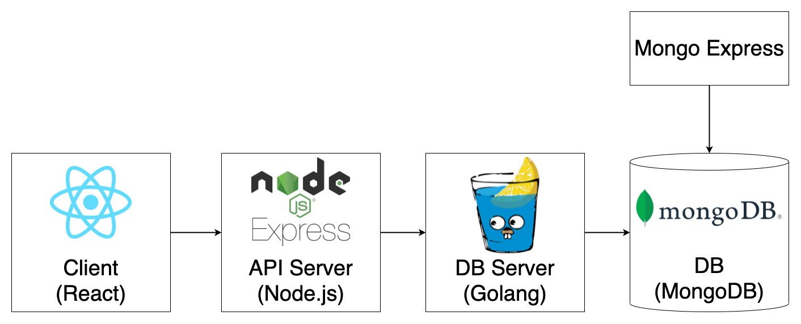

# NONALCHOLIC

A small and fun KAIST personality type test project.  
We know "Nonalcholic" is wrong. That is what we intended.

## Preview

[웹 시연 보기 (비디오)](https://drive.google.com/file/d/1b5uEbPUtygNwgtu5vy_8eGcmV5ZYhIzE/view?usp=sharing)  
[최종 결과 보기 (사진)](https://drive.google.com/file/d/1hj8FUJqBt2f3-zq7edVobQwjgsMHTsdy/view?usp=sharing)

## Diagram



## Prerequisite

- Docker
- Docker Compose
- Node
- React
- Go

## Development

### Environment Variable Settings

1. Check environment variables in /.env file.
2. Create /client/.env.development file and write like this.

```bash
REACT_APP_IP_ADDRESS=[YOUR IP ADDRESS] # ex. localhost
```

### Database + Backend + Frontend

```bash
cd path/to/repository
make up_dev
```

## Production

### Environment Variable Settings

1. Check environment variables in /.env file.
2. Create /client/.env.production file and write like this.

```bash
REACT_APP_IP_ADDRESS=[YOUR IP ADDRESS] # ex. 123.45.67.890
```

### Database + Backend + Frontend

1. Go to the docker-compose.yml in the root.
2. Use Dockerfile.prod in client-build-dockerfile.
3. Run below commands.

```bash
cd path/to/repository
make up
```
